<p>
  <a href="https://github.com/HBAI-Ltd/Toonflow-app">
    
  </a>
  &nbsp;|&nbsp;
  <a href="https://gitee.com/HBAI-Ltd/Toonflow-app">
    
  </a>
  &nbsp;|&nbsp;
  <a href="https://gitcode.com/HBAI-Ltd/Toonflow-app">
    
  </a>
</p>

<p align="center">
  <a href="../README.md">简体中文</a> | 
  <a href="./README.zhtw.md">繁體中文</a> | 
  <a href="./README.en.md">English</a> | 
  <a href="./README.th.md">ไทย</a> | 
  <strong>Tiếng Việt</strong> | 
  <a href="./README.ja.md">日本語</a> | 
  <a href="./README.ru.md">Русский</a>
</p>

<div align="center">
  <p align="center">
    
  </p>

  <p align="center">
    <a href="https://git.io/typing-svg" target="_blank">
      <picture>
        <source media="(prefers-color-scheme: dark)" srcset="https://readme-typing-svg.demolab.com?font=Fira+Code&size=40&duration=3000&pause=1000&color=FFFFFF&center=true&vCenter=true&width=600&lines=Toonflow;Nhà+máy+phim+ngắn+AI;Nhấc+ngón+tay%2C+tiểu+thuyết+thành+phim+trong+giây+lát!" />
        
      </picture>
    </a>
  </p>

  <p align="center">
    <a href="https://github.com/HBAI-Ltd/Toonflow-app/stargazers">
      
    </a>
    <a href="https://www.apache.org/licenses/LICENSE-2.0" target="_blank">
      
    </a>
    <a href="https://github.com/HBAI-Ltd/Toonflow-app/releases">
      
    </a>
  </p>
  <p align="center">
    <a href="https://github.com/HBAI-Ltd/Toonflow-app/network/members">
      
    </a>
    <a href="https://atomgit.com/HBAI-Ltd/Toonflow-app">
      
    </a>
    <a href="https://discord.gg/HEjKmpNpAZ">
      
    </a>
  </p>
  <p align="center">
    <a href="https://github.com/HBAI-Ltd/Toonflow-app/issues">
      
    </a>
    <a href="https://github.com/HBAI-Ltd/Toonflow-app/graphs/contributors">
      
    </a>
    <a href="https://github.com/HBAI-Ltd/Toonflow-app/commits">
      
    </a>
  </p>
  <p align="center">
    &nbsp;
    &nbsp;
    &nbsp;
    
  </p>
  
  > 🚀 **Quy trình sản xuất phim ngắn tất cả trong một**: Từ văn bản đến nhân vật, từ phân cảnh đến video, toàn bộ quy trình AI không rào cản, nâng cao hiệu suất sáng tạo lên hơn 10 lần!
</div>

<div align="center">
  <table>
    <tr>
      <td width="50%" align="center">
        <a href="./g-star.png" target="_blank">
          
        </a>
      </td>
      <td width="50%" align="center">
        <a href="./gvp.jpg" target="_blank">
          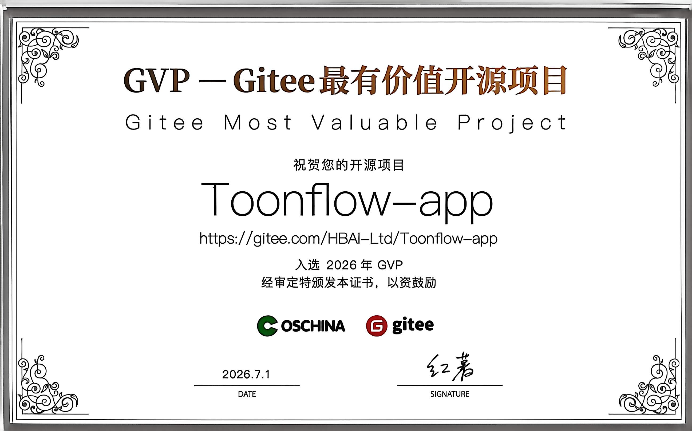
        </a>
      </td>
    </tr>
  </table>
</div>

---

# 🌐 Hỗ trợ đa ngôn ngữ

Toonflow hỗ trợ giao diện các ngôn ngữ sau:

| Ngôn ngữ       | Ngôn ngữ              |
| ---------- | --------------------- |
| 简体中文   | Tiếng Trung (Giản thể) |
| 繁體中文   | Tiếng Trung (Phồn thể) |
| English    | Tiếng Anh               |
| ไทย        | Tiếng Thái              |
| Tiếng Việt | Tiếng Việt            |
| 日本語     | Tiếng Nhật              |
| Русский    | Tiếng Nga              |

> 💡 Đang thích ứng thêm nhiều ngôn ngữ, hoan nghênh đóng góp bản dịch!

---

# 🌟 Chức năng chính

Toonflow là một bàn làm việc AI dành cho sản xuất phim ngắn, xoay quanh quy trình "Lên kế hoạch → Viết kịch bản → Phân cảnh → Xuất phim" để tạo thành một vòng lặp hoàn chỉnh, đồng thời hỗ trợ quy trình sản xuất có thể bản địa hóa, có thể lập trình và liên tục cải tiến.

- ✅ **Bàn làm việc sản xuất trên Canvas vô hạn**  
  Tổ chức kịch bản, nhân vật, phân cảnh, tài liệu và nút video dưới dạng canvas vô hạn, hỗ trợ sắp xếp tự do, quay lui và sản xuất song song, không bị giới hạn bởi các bước tuyến tính.
- ✅ **Hệ thống cộng tác Agent ba lớp**  
  Lớp ra quyết định, lớp thực thi và lớp giám sát làm việc cùng nhau, bao gồm phân rã nhiệm vụ, tạo nội dung, đánh giá chất lượng và phản hồi sửa đổi, nâng cao tính ổn định và nhất quán của thành phẩm.
- ✅ **Bộ nhớ Agent bền vững**  
  Hệ thống bộ nhớ xuyên phiên dựa trên truy xuất vector ONNX cục bộ, hỗ trợ tin nhắn ngắn hạn, tóm tắt dài hạn và truy xuất ngữ nghĩa, đảm bảo tính liên tục của sáng tạo qua nhiều vòng.
- ✅ **Hệ thống nhà cung cấp có thể lập trình**  
  Hỗ trợ viết trực tiếp logic TypeScript của nhà cung cấp trong trung tâm cài đặt và có hiệu lực ngay lập tức, không cần sửa mã nguồn hoặc khởi động lại, thuận tiện cho việc tư nhân hóa và kết nối đa mô hình.
- ✅ **Chuyển thể dựa trên đồ thị sự kiện chương**  
  Tự động trích xuất các sự kiện chương của tác phẩm gốc và lưu trữ có cấu trúc, chuyển thể kịch bản gọi ngữ cảnh chính xác theo đồ thị sự kiện, giảm mất thông tin văn bản dài.
- ✅ **Cấu hình Skill dưới dạng tệp**  
  Lời nhắc cốt lõi của ScriptAgent và ProductionAgent được ngoại hóa thành các tệp Markdown Skill, hỗ trợ chỉnh sửa trực tuyến và tối ưu hóa nhanh chóng.

---

# 📦 Kịch bản ứng dụng

- Sáng tạo nội dung video ngắn
- Thử nghiệm điện ảnh hóa tiểu thuyết
- Công cụ chuyển thể văn học AI
- Phát triển kịch bản và tạo mẫu nhanh
- Tạo tài liệu video

---

# 🔰 Hướng dẫn sử dụng

## Bắt đầu nhanh

1. Khởi động ứng dụng và đăng nhập (tài khoản mặc định: `admin` / `admin123`).
2. Hoàn tất cấu hình nhà cung cấp mô hình trong trung tâm cài đặt (mô hình văn bản/hình ảnh/video).
3. Tạo dự án mới và nhập tác phẩm gốc, thực hiện trích xuất sự kiện chương.
4. Vào ScriptAgent để tạo khung cốt truyện, chiến lược chuyển thể và kịch bản có cấu trúc.
5. Chuyển sang ProductionAgent, tổ chức các nút phân cảnh, tài liệu và video trong canvas vô hạn.
6. Tinh chỉnh từng nút cho ảnh phân cảnh rồi đưa trở lại bàn làm việc, hoàn tất ghép nối và xuất video.

## 📺 Hướng dẫn bằng video

https://www.bilibili.com/video/BV1oXD7BqEqJ
[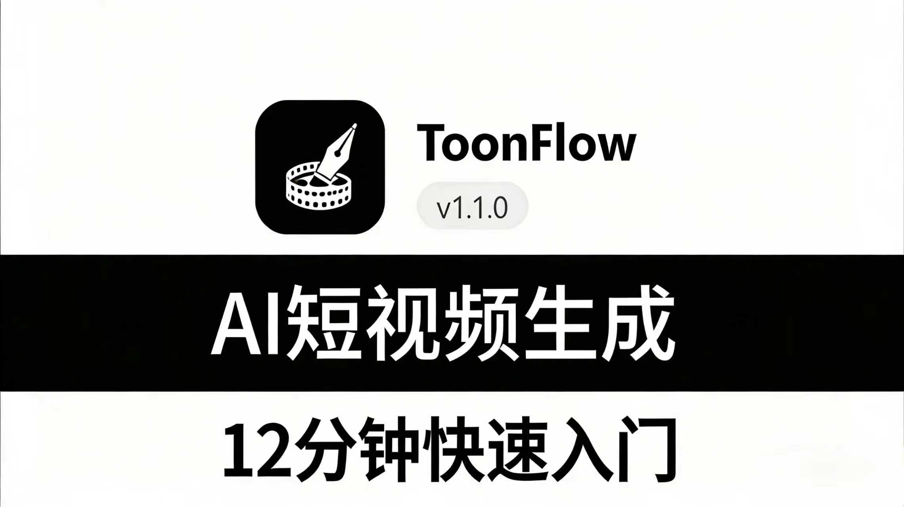](https://www.bilibili.com/video/BV1oXD7BqEqJ)

**Toonflow 12 phút bắt đầu nhanh với AI Video**
👉 [Nhấp để xem](https://www.bilibili.com/video/BV1oXD7BqEqJ)

📱 Quét mã QR bằng WeChat để xem


---

# 📸 Ảnh chụp màn hình và video trình diễn

Các ảnh chụp màn hình và video dưới đây đến từ một bản demo phim ngắn AI được tạo bằng Toonflow, toàn bộ quá trình hoàn thành trong khoảng 2 giờ, bao gồm tạo kịch bản, làm phân cảnh và chỉnh sửa.

<div align="center">
<table>
  <tr>
    <td width="50%"><a href="./screenshot/1.png" target="_blank">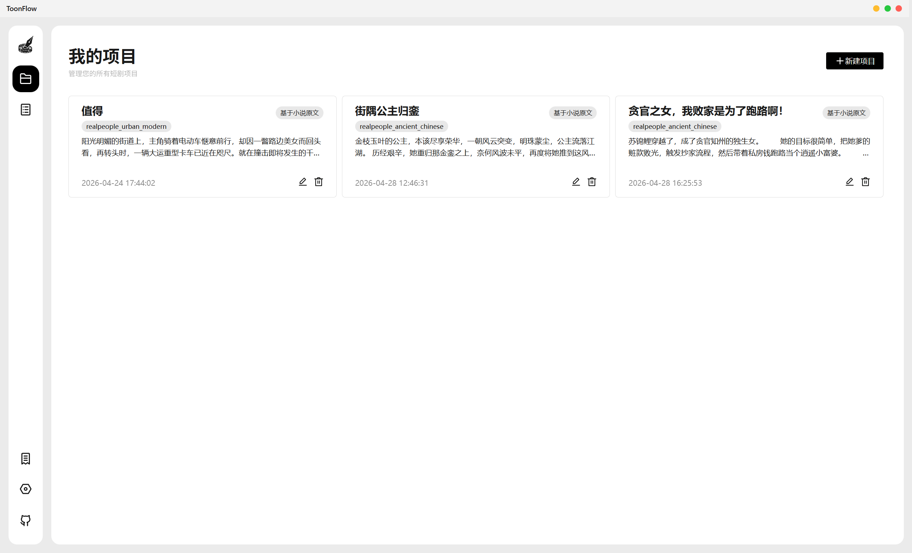</a></td>
    <td width="50%"><a href="./screenshot/2.png" target="_blank">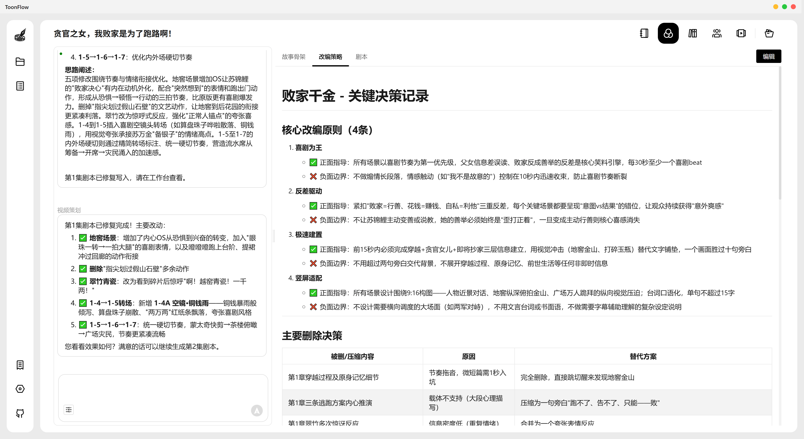</a></td>
  </tr>
  <tr>
    <td width="50%"><a href="./screenshot/3.png" target="_blank">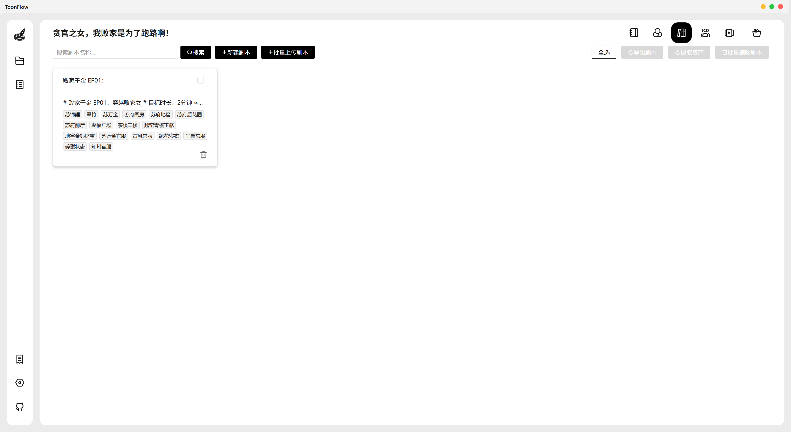</a></td>
    <td width="50%"><a href="./screenshot/4.png" target="_blank">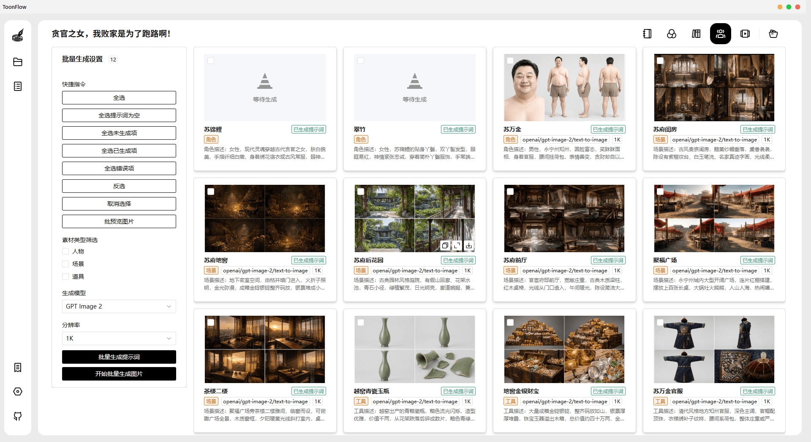</a></td>
  </tr>
  <tr>
    <td width="50%"><a href="./screenshot/5.png" target="_blank">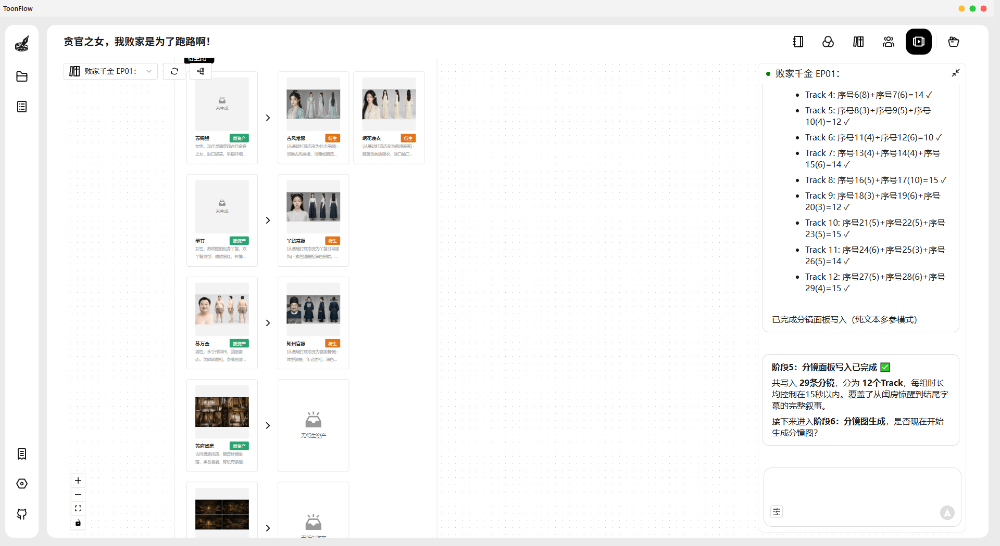</a></td>
    <td width="50%"><a href="./screenshot/6.png" target="_blank">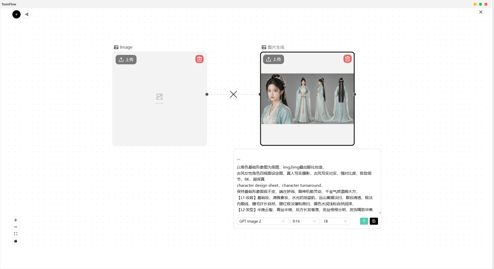</a></td>
  </tr>
  <tr>
    <td width="50%"><a href="./screenshot/7.png" target="_blank">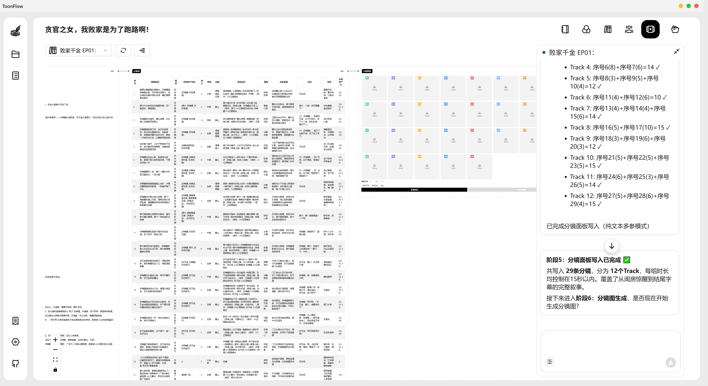</a></td>
    <td width="50%"><a href="./screenshot/8.png" target="_blank">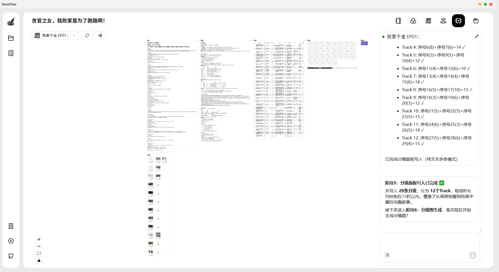</a></td>
  </tr>
  <tr>
    <td width="50%"><a href="./screenshot/9.png" target="_blank">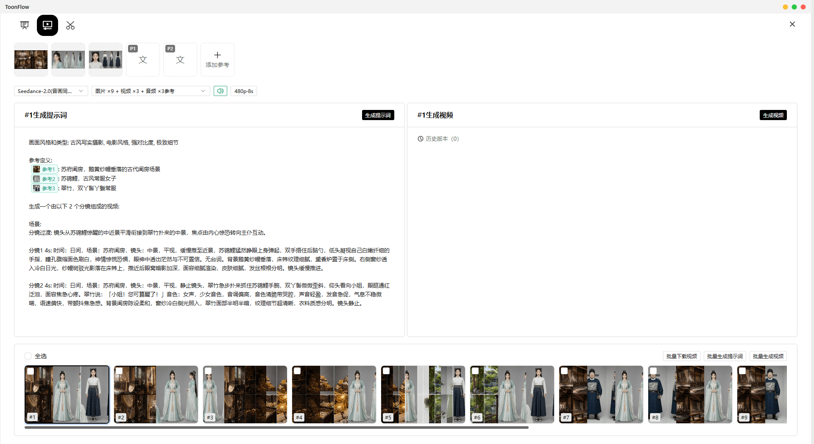</a></td>
    <td width="50%"><a href="./screenshot/10.png" target="_blank">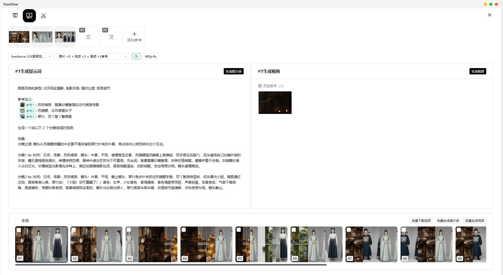</a></td>
  </tr>
</table>
</div>

## 🎬 Video Demo

<div align="center">

https://github.com/user-attachments/assets/2d9fddac-dfdf-4640-b030-b09d7f7287e9

Nếu không phát được, vui lòng [nhấp để tải video](./screenshot/demo.mp4)

</div>

## Thông tin Demo

| Dự án | Chi tiết |
| :--- | :--- |
| Thời gian sản xuất | Khoảng 2 giờ |
| Mô hình video | Seedance 2.0 |
| Mô hình hình ảnh | GPT Image 2 |
| Mô hình ngôn ngữ | Claude Opus 4.6 |
| Tổng thời lượng thành phẩm | Khoảng 2 phút (tài liệu gốc 3 phút, cắt bỏ cảnh lỗi khoảng 1 phút) |

## Chi phí chi tiết

| Loại mô hình | Chi phí |
| :--- | :--- |
| Mô hình ngôn ngữ | Khoảng ¥10 |
| Mô hình video (tạo toàn bộ) | Khoảng ¥120 |
| Mô hình hình ảnh | Dưới ¥1 |
| **Tổng cộng** | **Khoảng ¥130** |

> **Tuyên bố**: Độ phân giải gốc của Demo là 1080×1882, phiên bản phát hành đã được nén xuống 480p. Nếu có vấn đề về bản quyền, vui lòng liên hệ chúng tôi để xóa bỏ.

---

# 🚀 Cài đặt

## Điều kiện tiên quyết

Trước khi cài đặt và sử dụng phần mềm này, vui lòng chuẩn bị những nội dung sau:

- ✅ Địa chỉ giao diện dịch vụ AI mô hình ngôn ngữ lớn
- ✅ Địa chỉ giao diện dịch vụ video Sora hoặc Doubao
- ✅ Giao diện dịch vụ mô hình tạo hình ảnh Nano Banana Pro

## Cài đặt máy

### 1. Tải xuống và cài đặt

| Hệ điều hành | GitHub | Ghi chú |
| :------: |:------------------------------------------------------------|:------------- |
| Windows | [Release](https://github.com/HBAI-Ltd/Toonflow-app/releases) | Gói cài đặt chính thức |
| Linux | [Release](https://github.com/HBAI-Ltd/Toonflow-app/releases) | Gói cài đặt chính thức |
| macOS | [Release](https://github.com/HBAI-Ltd/Toonflow-app/releases) | Gói cài đặt chính thức |

> [!CAUTION]
> Hệ thống MacOS vui lòng vào Cài đặt-Quyền riêng tư & Bảo mật để cấu hình bảo mật, nếu không có thể không mở được do vấn đề chứng chỉ
>
> Tham khảo tài liệu Zhihu: [https://www.zhihu.com/question/433389276](https://www.zhihu.com/question/433389276)

> Do hạn chế về môi trường của Gitee OS và giới hạn kích thước tải lên tệp Release, tạm thời không cung cấp địa chỉ tải xuống Gitee Release.

### 2. Khởi động dịch vụ

Sau khi cài đặt hoàn tất, khởi động chương trình để bắt đầu sử dụng dịch vụ này.

> ⚠️ **Đăng nhập lần đầu**  
> Tài khoản: `admin`  
> Mật khẩu: `admin123`

## Triển khai Docker

### Điều kiện tiên quyết

- Đã cài đặt [Docker](https://docs.docker.com/get-docker/) (phiên bản 20.10+)

### Cách 1: Triển khai trực tuyến

Đang hoàn thiện, tạm thời sử dụng bản dựng cục bộ.

### Cách 2: Dựng cục bộ

Sử dụng mã nguồn có sẵn tại địa phương để xây dựng trực tiếp, phù hợp với nhà phát triển hoặc người dùng đã clone kho lưu trữ, điều này yêu cầu bạn cài đặt git cục bộ:

```shell
# Đầu tiên clone dự án (nếu đã có thì bỏ qua)
git clone https://github.com/HBAI-Ltd/Toonflow-app.git
cd Toonflow-app

# Sử dụng docker-compose để xây dựng và khởi động cục bộ
yarn docker:local

# Hoặc xây dựng thủ công
docker build -t toonflow .
docker run -d -p <cổng_local>:10588 -v <đường_dẫn_dữ_liệu_local>:/app/data toonflow

# Lúc này, tại đường dẫn /index.html của cổng tương ứng có thể truy cập trang
# Ví dụ http://localhost:10588/index.html
```

### Giải thích cổng dịch vụ

| Cổng | Mục đích | Ánh xạ triển khai |
| ------- | -------- | ------------- |
| `10588` | Giao diện phần mềm | `10588:10588` |

**Giải thích biến môi trường:**

| Biến | Giải thích |
| ---------- | ---------------------------------- |
| `NODE_ENV` | Môi trường chạy, `prod` là môi trường sản xuất |
| `PORT` | Cổng lắng nghe dịch vụ (mặc định 10588) |
| `OSSURL` | Địa chỉ truy cập lưu trữ tệp, dùng để truy cập tài nguyên tĩnh |

---

## Triển khai đám mây

### Triển khai máy chủ đám mây

#### I. Yêu cầu môi trường máy chủ

- **Hệ thống**: Ubuntu 20.04+ / CentOS 7+
- **Node.js**: 24.x (khuyến nghị, tối thiểu 23.11.1+)
- **Bộ nhớ**: 2GB+

#### II. Triển khai máy chủ

##### 1. Cài đặt môi trường

```bash
# Cài đặt Node.js
curl -o- https://raw.githubusercontent.com/nvm-sh/nvm/v0.39.7/install.sh | bash
source ~/.bashrc
nvm install 24
# Cài đặt Yarn và PM2
npm install -g yarn pm2
```

##### 2. Triển khai dự án

**Clone từ GitHub:**

```bash
cd /opt
git clone https://github.com/HBAI-Ltd/Toonflow-app.git
cd Toonflow-app
yarn install
yarn build
```

**Clone từ Gitee (khuyến nghị cho nội địa Trung Quốc):**

```bash
cd /opt
git clone https://gitee.com/HBAI-Ltd/Toonflow-app.git
cd Toonflow-app
yarn install
yarn build
```

##### 3. Cấu hình PM2

Tạo tệp `pm2.json`:

```json
{
  "name": "toonflow-app",
  "script": "data/serve/app.js",
  "instances": "max",
  "exec_mode": "cluster",
  "env": {
    "NODE_ENV": "prod",
    "PORT": 10588,
    "OSSURL": "http://127.0.0.1:10588/"
  }
}
```

**Giải thích biến môi trường:**

| Biến | Giải thích |
| ---------- | ---------------------------------- |
| `NODE_ENV` | Môi trường chạy, `prod` là môi trường sản xuất |
| `PORT` | Cổng lắng nghe dịch vụ |
| `OSSURL` | Địa chỉ truy cập lưu trữ tệp, dùng để truy cập tài nguyên tĩnh |

---

##### 4. Khởi động dịch vụ

```bash
pm2 start pm2.json
pm2 startup
pm2 save
```

##### 5. Các lệnh thường dùng

```bash
pm2 list              # Xem tiến trình
pm2 logs toonflow-app # Xem nhật ký
pm2 restart all       # Khởi động lại dịch vụ
pm2 monit             # Bảng điều khiển giám sát
```

> ⚠️ **Đăng nhập lần đầu**  
> Tài khoản: `admin`  
> Mật khẩu: `admin123`

##### 6. Triển khai trang web frontend

Nếu cần triển khai riêng lẻ hoặc tùy chỉnh giao diện frontend, vui lòng tham khảo kho lưu trữ frontend:

- **GitHub**: [Toonflow-web](https://github.com/HBAI-Ltd/Toonflow-web)
- **Gitee**: [Toonflow-web](https://gitee.com/HBAI-Ltd/Toonflow-web)

> 💡 **Ghi chú**: Kho lưu trữ này đã được tích hợp sẵn tài nguyên frontend đã biên dịch, người dùng thông thường không cần triển khai riêng frontend. Kho lưu trữ frontend chỉ dành cho các nhà phát triển cần phát triển thứ cấp.

### Triển khai nền tảng đám mây

> 🎉 **Nền tảng đối tác tính toán được chứng nhận chính thức mới —— Zhixing Cloud (AI Galaxy)**
>
> **[Zhixing Cloud (AI Galaxy)](https://www.ai-galaxy.com/)** là **nhà cung cấp image thương mại được Toonflow chính thức ủy quyền**, đã hợp pháp cài đặt, phân phối và hỗ trợ sử dụng thương mại toàn bộ image sản xuất phim ngắn AI của Toonflow, **sẵn sàng sử dụng ngay, không cần triển khai thủ công**.
>
> - 🌐 Trang chủ: [https://www.ai-galaxy.com](https://www.ai-galaxy.com)
> - 📖 Hướng dẫn triển khai image chính thức: [Nhấp để xem](https://mp.weixin.qq.com/s/lq9X1ovQ1_TKeXMOLgicKg?scene=1)

<details>
<summary>📄 Nhấp để mở rộng hướng dẫn dạng văn bản</summary>

#### I. Giai đoạn thuê GPU

1. Trên Zhixing Cloud - Chợ tính toán - 4090 / 4090 Plus, nhấp "Thuê ngay" để vào trang chi tiết thuê.
   > 💡 Nên bật chế độ "tự động gia hạn theo giờ" để tránh phiên bản hết hạn khi video đang render.
2. Chọn image: `windows10LTSCwin10_Toonflow` - Tạo phiên bản (instance).
3. Đợi phiên bản khởi động 30~60 giây, kiểm tra phương thức kết nối - tải file đăng nhập RDP - sao chép mật khẩu - nhấp đúp vào file kết nối đám mây đã tải xuống.
4. Dán mật khẩu đã sao chép và đăng nhập, kết nối vào màn hình đám mây.
   > 💡 Di chuột đến đầu màn hình đám mây và dừng lại một chút, thanh công cụ chuyển đổi màn hình sẽ hiện ra, có thể nhấp "──" để chuyển về màn hình máy tính của bạn, hoặc "□" để thu nhỏ thành cửa sổ trên màn hình máy tính của bạn.

#### II. Giai đoạn cấu hình Toonflow, khởi động ComfyUI

1. Trước tiên cấu hình mô hình mà Agent gọi: mở Toonflow trên màn hình - Dịch vụ mô hình - Giao diện chuẩn OpenAI - điền khóa API và địa chỉ yêu cầu.
   Tài khoản mặc định: `admin`  Mật khẩu: `admin123` (nên đổi mật khẩu sau khi đăng nhập)
   > 💡 ửe đây trực tiếp sử dụng dịch vụ Token mô hình ngôn ngữ lớn AI của Zhixing Cloud, giao diện chính thức, ổn định và an toàn, giảm giá tới 40% (chuyển tiểu thuyết thành kịch bản chỉ tốn khoảng ¥0.64).
   - Địa chỉ yêu cầu Token gọi mô hình của Zhixing Cloud: `https://token.ai-galaxy.com/v1`
   - Các bước nạp Token của Zhixing Cloud: Chợ Token - Tổng quan tài khoản - Nạp tiền - nạp số dư tài khoản Zhixing Cloud hoặc phiếu tính toán vào tài khoản Token.
   - Sau khi nạp tiền, vào "Quản lý Key" - Tạo API mới, đặt tên là `Toonflow` hoặc tên khác tùy ý, nhấp xác nhận và sao chép khóa API.
2. Quay lại bước 1, dán khóa API và địa chỉ yêu cầu đã tạo vào Dịch vụ mô hình của Toonflow, điền xong nhấp vào chỗ trống, hệ thống sẽ hiển thị "Cấu hình nhà cung cấp đã được cập nhật".
   Nhấp "Thêm thủ công", quay lại trang Chợ Token của Zhixing Cloud, sao chép đầy đủ tên mô hình.
   > 💡 Một Key có thể gọi tất cả các mô hình trên Zhixing Cloud, chọn mô hình bạn muốn dùng là được, khuyến nghị `deepseek-v4-pro`.
   Dán tên mô hình đầy đủ vào Toonflow và xác nhận để hoàn tất cấu hình mô hình.
3. Sau khi cấu hình xong, kiểm tra hai điểm:
   - Ba công tắc gọi mô hình trong Dịch vụ mô hình đã được bật hay chưa
   - Mô hình được gọi trong cấu hình Agent có khớp với cấu hình của bạn hay không (nếu không khớp, nhấp để sửa)
4. Khởi động ComfyUI: Màn hình đám mây - Bộ khởi chạy ComfyUI - Khởi động một chạm.
5. Khởi động mất khoảng 1~2 phút, sau khi khởi động xong giữ trang ở trạng thái mở.

</details>

---

# 🔧 Hướng dẫn quy trình phát triển

> [!CAUTION]
> 🚧 **Quy tắc gửi PR** 🚧
>
> ⛔ Nhánh `master` không chấp nhận bất kỳ PR nào ｜ ✅ Vui lòng gửi PR đến nhánh `develop`
>
> Chào mừng các nhà phát triển cùng tham gia xây dựng Toonflow. Nếu có hứng thú tham gia, vui lòng liên hệ quản lý ACT trong nhóm trao đổi.

## 🛠️ Tech Stack

| Danh mục | Công nghệ |
| ---------- | ----------------------------------------------------------------------------------------- |
| Môi trường chạy | Node.js 23.11.1+ |
| Ngôn ngữ | TypeScript 5.x |
| Backend Framework | Express 5 |
| Cơ sở dữ liệu | SQLite (better-sqlite3 / knex) |
| Tích hợp AI | Vercel AI SDK (OpenAI / Anthropic / Google / DeepSeek / Zhipu / MiniMax / Tongyi Qianwen / xAI) |
| Suy luận cục bộ | @huggingface/transformers (ONNX) |
| Giao tiếp thời gian thực | Socket.IO |
| Ứng dụng desktop | Electron 40 |
| Xử lý hình ảnh | Sharp |
| Container hóa | Docker |

## Chuẩn bị môi trường phát triển

- **Node.js**: Yêu cầu phiên bản 23.11.1 trở lên
- **Yarn**: Khuyến nghị sử dụng làm trình quản lý gói cho dự án

## Khởi động nhanh dự án

1. **Clone dự án**

   **Clone từ GitHub:**

   ```bash
   git clone https://github.com/HBAI-Ltd/Toonflow-app.git
   cd Toonflow-app
   ```

   **Clone từ Gitee (khuyến nghị cho nội địa Trung Quốc):**

   ```bash
   git clone https://gitee.com/HBAI-Ltd/Toonflow-app.git
   cd Toonflow-app
   ```

2. **Cài đặt phụ thuộc**

   Vui lòng thực hiện lệnh sau trong thư mục gốc của dự án để cài đặt các phụ thuộc:

   ```bash
   yarn install
   ```

3. **Khởi động môi trường phát triển**

   Dự án này bao gồm **Dịch vụ API backend** và **Trang frontend** hai phần, vui lòng chọn cách khởi động theo nhu cầu:

   - **Cách 1: Chỉ khởi động dịch vụ backend**

     ```bash
     yarn dev
     ```

     > ⚠️ Lệnh này chỉ khởi động dịch vụ API backend (cổng 10588), **không bao gồm trang frontend**. Truy cập trực tiếp `http://localhost:10588` chỉ có thể gọi các API, không thấy được giao diện web đầy đủ. Nếu muốn sử dụng đồng thời trang frontend, vui lòng kết hợp với dự án frontend khởi động riêng, hoặc sử dụng chế độ GUI bên dưới.

   - **Cách 2: Khởi động ứng dụng desktop Electron**

     ```bash
     yarn dev:gui
     ```

     > Lệnh này sẽ đồng thời khởi động dịch vụ backend và cửa sổ desktop Electron, có sẵn trang frontend tích hợp, dùng ngay, không cần cấu hình thêm. Phù hợp với nhà phát triển muốn trải nghiệm đầy đủ tất cả chức năng.

   - **Cách 3: Khởi động chế độ sản xuất**

     ```bash
     yarn start
     ```

     > Chạy trực tiếp dịch vụ đã biên dịch ở chế độ sản xuất (cần thực hiện `yarn build` trước).

4. **Đóng gói dự án**

   - Biên dịch và tạo tệp TypeScript:

     ```bash
     yarn build
     ```

   - Đóng gói thành chương trình thực thi cho Windows:

     ```bash
     yarn dist:win
     ```

   - Đóng gói thành chương trình thực thi cho Mac:

     ```bash
     yarn dist:mac
     ```

   - Đóng gói thành chương trình thực thi cho Linux:

     ```bash
     yarn dist:linux
     ```

5. **Kiểm tra chất lượng mã**

   - Thực hiện kiểm tra cú pháp và quy tắc toàn cục:

     ```bash
     yarn lint
     ```

6. **Bảng điều khiển gỡ lỗi AI (Tùy chọn)**

   Khởi động công cụ gỡ lỗi trực quan của AI SDK, tiện lợi cho việc gỡ lỗi các cuộc gọi AI:

   ```bash
   yarn debug:ai
   ```

## Phát triển Frontend

Nếu muốn sửa đổi giao diện frontend, vui lòng đến kho lưu trữ frontend để phát triển:

- **GitHub**: [Toonflow-web](https://github.com/HBAI-Ltd/Toonflow-web)
- **Gitee**: [Toonflow-web](https://gitee.com/HBAI-Ltd/Toonflow-web)

Sau khi xây dựng frontend, sao chép nội dung thư mục `dist` vào thư mục `data/web` của dự án này để tích hợp.

## Cấu trúc dự án

```
📂 build/                    # Sản phẩm biên dịch
📂 data/                     # Dữ liệu thời gian chạy
│  ├─ 📂 models/            # Mô hình suy luận cục bộ (ONNX)
│  ├─ 📂 oss/               # Lưu trữ đối tượng (tài liệu/nhân vật/bối cảnh)
│  ├─ 📂 serve/             # Điểm vào môi trường sản xuất
│  ├─ 📂 skills/            # Lời nhắc kỹ năng Agent
│  └─ 📂 web/               # Sản phẩm biên dịch frontend (tích hợp sẵn)
📂 docs/                     # Tài liệu
📂 env/                      # Cấu hình môi trường
📂 scripts/                  # Tập lệnh xây dựng và hỗ trợ
📂 src/
├─ 📂 agents/               # Mô-đun AI Agent
│  ├─ 📂 productionAgent/   # Agent sản xuất
│  └─ 📂 scriptAgent/       # Agent kịch bản
├─ 📂 lib/                  # Thư viện công cộng (khởi tạo cơ sở dữ liệu, định dạng phản hồi)
├─ 📂 middleware/            # Middleware
├─ 📂 routes/               # Mô-đun định tuyến
│  ├─ 📂 agents/            # Quản lý bộ nhớ Agent
│  ├─ 📂 artStyle/          # Quản lý phong cách
│  ├─ 📂 assets/            # Quản lý tài liệu
│  ├─ 📂 assetsGenerate/    # Tạo tài liệu
│  ├─ 📂 cornerScape/       # Quản lý phân cảnh
│  ├─ 📂 general/           # API chung
│  ├─ 📂 login/             # Xác thực đăng nhập
│  ├─ 📂 migrate/           # Di chuyển dữ liệu
│  ├─ 📂 modelSelect/       # Lựa chọn mô hình
│  ├─ 📂 novel/             # Quản lý tiểu thuyết
│  ├─ 📂 other/             # Chức năng khác
│  ├─ 📂 production/        # Quản lý sản xuất
│  ├─ 📂 project/           # Quản lý dự án
│  ├─ 📂 script/            # Tạo kịch bản
│  ├─ 📂 scriptAgent/       # API Agent kịch bản
│  ├─ 📂 setting/           # Cài đặt hệ thống
│  ├─ 📂 task/              # Quản lý tác vụ
│  └─ 📂 test/              # API kiểm thử
├─ 📂 socket/               # Giao tiếp thời gian thực WebSocket
├─ 📂 types/                # Khai báo kiểu TypeScript
├─ 📂 utils/                # Hàm tiện ích
├─ 📄 app.ts                # Điểm vào ứng dụng
├─ 📄 core.ts               # Khởi tạo lõi
├─ 📄 env.ts                # Xử lý biến môi trường
├─ 📄 err.ts                # Xử lý lỗi
├─ 📄 logger.ts             # Mô-đun nhật ký
├─ 📄 router.ts             # Đăng ký định tuyến
└─ 📄 utils.ts              # Tiện ích chung
📄 Dockerfile                # Tệp xây dựng Docker
📄 electron-builder.yml      # Cấu hình đóng gói Electron
📄 skillList.json            # Danh sách kỹ năng
📄 LICENSE                   # Giấy phép (Apache-2.0)
📄 NOTICES.txt               # Tuyên bố phụ thuộc bên thứ ba
📄 package.json              # Cấu hình dự án
📄 tsconfig.json             # Cấu hình TypeScript
```

---

# 🔗 Kho lưu trữ liên quan

| Kho lưu trữ | Giải thích | GitHub | Gitee |
| ---------------- | ---------------------------------- | -------------------------------------------------- | ------------------------------------------------ |
| **Toonflow-app** | Ứng dụng đầy đủ (kho lưu trữ này, khuyến nghị cho người dùng thông thường) | [GitHub](https://github.com/HBAI-Ltd/Toonflow-app) | [Gitee](https://gitee.com/HBAI-Ltd/Toonflow-app) |
| **Toonflow-web** | Mã nguồn frontend (phù hợp với nhà phát triển frontend) | [GitHub](https://github.com/HBAI-Ltd/Toonflow-web) | [Gitee](https://gitee.com/HBAI-Ltd/Toonflow-web) |

> 💡 **Gợi ý**: Nếu bạn chỉ muốn sử dụng Toonflow, hãy tải trực tiếp ứng dụng từ kho lưu trữ này. Kho lưu trữ frontend chỉ dành cho các nhà phát triển cần phát triển thứ cấp hoặc tùy chỉnh giao diện frontend.

---

# 👨‍👩‍👧‍👦 Nhóm WeChat

Trợ lý thêm nhóm:


Cũng có thể nhấp vào biểu tượng để tham gia Discord:

[](https://discord.gg/HEjKmpNpAZ)

Hoặc nhấp vào liên kết mời: [https://discord.gg/HEjKmpNpAZ](https://discord.gg/HEjKmpNpAZ)

---

# 💌 Liên hệ với chúng tôi

📧 Email: [ltlctools@outlook.com](mailto:ltlctools@outlook.com?subject=Toonflow咨询)

---

# 📜 Giấy phép

Toonflow được phát hành dưới dạng mã nguồn mở dựa trên giấy phép Apache-2.0, kèm theo thỏa thuận thương mại bổ sung.

Chi tiết giấy phép: https://www.apache.org/licenses/LICENSE-2.0

## Thỏa thuận bổ sung

- Nếu phân phối phần mềm này dưới dạng sản phẩm cho **2 bên thứ ba độc lập trở lên** sử dụng, phải có **giấy phép thương mại bằng văn bản** từ HBAI-Ltd.
- **≤ 5 pháp nhân** đồng vận hành sử dụng nội bộ, không cung cấp dịch vụ ra bên ngoài, được coi là sử dụng nội bộ, **không cần cấp phép**.
- Không được xóa hoặc sửa đổi nhãn hiệu hoặc thông tin bản quyền trong Toonflow.

## Kịch bản miễn phí vĩnh viễn

- ✅ Sử dụng Toonflow để tạo nội dung và nhận chia sẻ doanh thu từ nền tảng
- ✅ Phát triển thứ cấp cho nhóm của riêng bạn sử dụng nội bộ
- ✅ ≤ 5 pháp nhân đồng vận hành sử dụng nội bộ
- ✅ Học tập, nghiên cứu cá nhân, mục đích phi thương mại

## Định giá cấp phép thương mại

| Giai đoạn | Doanh thu hàng năm | Phí hàng năm |
|------|---------|------|
| 🌱 Giai đoạn hỗ trợ | < ¥100.000 | **Đăng ký là được cấp phép miễn phí** |
| 🚀 Giai đoạn khởi nghiệp | ¥100.000–500.000 | ¥5.000/năm |
| 📈 Giai đoạn tăng trưởng | ¥500.000–1.500.000 | ¥20.000/năm |
| 🏢 Giai đoạn quy mô | ¥1.500.000–5.000.000 | ¥80.000/năm |
| 🌐 Cấp doanh nghiệp | > ¥5.000.000 | Thương lượng |

> **Điều khoản không truy thu**: Người dùng đã sử dụng theo AGPL-3.0 trước khi phát hành v1.0.8 tiếp tục thực hiện theo AGPL-3.0, không bị ràng buộc bởi các thay đổi của thỏa thuận này.

Thỏa thuận đầy đủ xem trong tệp [LICENSE](./LICENSE).

---

# ⭐️ Lịch sử Star

[](https://www.star-history.com/#HBAI-Ltd/Toonflow-app)

[](https://star-history.dera.page/#HBAI-Ltd/Toonflow-app&type=timeline&legend=top-left)

---


# 🙏 Lời cảm ơn

Cảm ơn các dự án mã nguồn mở sau đã cung cấp hỗ trợ mạnh mẽ cho Toonflow:

- [Express](https://expressjs.com/) - Framework Web Node.js nhanh, mở, tối giản
- [AI SDK](https://ai-sdk.dev/) - Bộ công cụ AI dành cho TypeScript
- [Better-SQLite3](https://github.com/WiseLibs/better-sqlite3) - Thư viện liên kết SQLite3 hiệu suất cao
- [Sharp](https://sharp.pixelplumbing.com/) - Thư viện xử lý hình ảnh Node.js hiệu suất cao
- [Axios](https://axios-http.com/) - HTTP client dựa trên Promise
- [Zod](https://zod.dev/) - Thư viện xác thực lược đồ ưu tiên TypeScript
- [Socket.IO](https://socket.io/) - Công cụ giao tiếp sự kiện hai chiều thời gian thực
- [Electron](https://www.electronjs.org/) - Framework phát triển ứng dụng desktop đa nền tảng
- [Hugging Face Transformers](https://huggingface.co/docs/transformers.js) - Thư viện suy luận ML cục bộ

Cảm ơn các tổ chức/đơn vị/cá nhân sau đã cung cấp hỗ trợ cho Toonflow:

<table>
  <thead>
    <tr>
      <th align="center">Logo</th>
      <th align="center">Tên</th>
      <th align="center">Hình thức hỗ trợ</th>
      <th>Giới thiệu</th>
      <th align="center">Trang web</th>
    </tr>
  </thead>
  <tbody>
    <tr>
      <td align="center">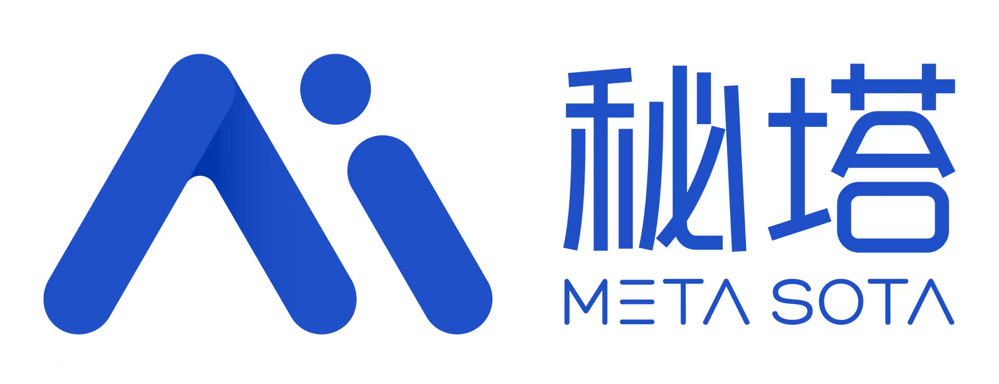</td>
      <td align="center"><b>Metaso</b></td>
      <td align="center">💻 Tài trợ sức mạnh tính toán</td>
      <td>Metaso Technology cung cấp dịch vụ tạo video MiniMax H3 với chi phí hợp lý: <b>768P chỉ 0,09 NDT/giây, 2K chỉ 0,15 NDT/giây</b>. Hỗ trợ 2K gốc, đồng bộ âm thanh - hình ảnh, API tương thích <b>giao thức OpenAI</b>, đồng thời hỗ trợ <b>ComfyUI</b>, <b>canvas vô hạn</b>, không cần tự triển khai GPU.<br/><br/>🎁 Đăng ký qua <a href="https://metaso.cn/minimax-h3/?s=toon">liên kết độc quyền</a> để nhận credit tặng kèm và ưu đãi độc quyền. Liên hệ hợp tác kinh doanh qua WeChat: metasota12</td>
      <td align="center"><a href="https://metaso.cn/minimax-h3/?s=toon">Trang web</a></td>
    </tr>
    <tr>
      <td align="center"></td>
      <td align="center"><b>APIMart</b></td>
      <td align="center">💻 Tài trợ sức mạnh tính toán</td>
      <td>Cảm ơn APIMart đã tài trợ cho dự án này! APIMart là nền tảng API giá rẻ chuyên về tạo hình ảnh/video bằng AI, <b>GPT-Image-2 chỉ từ $0.006/ảnh</b>, 1 đô la tạo được hơn 160 ảnh. Một bộ API bất đồng bộ dùng chung cho cả hình ảnh và video: gửi tác vụ nhận ID, lấy kết quả qua polling hoặc callback. Xử lý hàng loạt hàng chục nghìn ảnh không timeout, đổi model không cần sửa code. Trả phí theo mức sử dụng, không phí hàng tháng — <a href="https://go.apimart.ai/gh-toonflow-app">đăng ký tại đây</a> để bắt đầu sử dụng.</td>
      <td align="center"><a href="https://go.apimart.ai/gh-toonflow-app">Trang web</a></td>
    </tr>
    <tr>
      <td align="center"></td>
      <td align="center"><b>Sophnet</b></td>
      <td align="center">💻 Tài trợ sức mạnh tính toán</td>
      <td>Cam kết tạo nền tảng dịch vụ API suy luận mô hình tất cả trong một nhanh hơn, ổn định hơn, tiết kiệm hơn</td>
      <td align="center"><a href="https://www.sophnet.com/">Trang web</a></td>
    </tr>
    <tr>
      <td align="center"></td>
      <td align="center"><b>Tencent Hunyuan 3D</b></td>
      <td align="center">🌐 Hỗ trợ kỹ thuật mô hình thế giới</td>
      <td>Tencent Hunyuan 3D AI Creation Engine dựa trên phiên bản 2.5 của mô hình tạo 3D lớn Hunyuan, nền tảng tạo nội dung 3D AI tất cả trong một đầu tiên trong ngành. Có các chức năng như tạo 3D từ văn bản, hình ảnh, tạo hoạt ảnh 3D, tạo kết cấu, hỗ trợ tạo 3D từ phác thảo, tạo nhân vật 3D, có lợi thế trong việc tạo mô hình đa giác thấp.</td>
      <td align="center"><a href="https://3d.hunyuan.tencent.com/">Trang web</a></td>
    </tr>
    <tr>
      <td align="center"></td>
      <td align="center"><b>Zhixing Cloud (智星云)</b></td>
      <td align="center">💻 Hỗ trợ tính toán <br/> 🖼️ Hỗ trợ image</td>
      <td>Thương hiệu dịch vụ tính toán chuyên nghiệp nổi tiếng tại Trung Quốc, cung cấp năng lực tính toán giá rẻ và ổn định. Phục vụ phòng thí nghiệm của hơn một nghìn trường đại học hàng đầu (Thanh Hoa, Bắc Kinh, Phục Đán, Chiết Giang...), Viện Hàn lâm Khoa học Trung Quốc và hơn 5.000 doanh nghiệp AI.</td>
      <td align="center"><a href="https://www.ai-galaxy.com">Trang chủ</a></td>
    </tr>
  </tbody>
</table>

Danh sách đầy đủ các phụ thuộc bên thứ ba vui lòng tham khảo `NOTICES.txt`

##### copyright © Beijing Ai'ah Technology Co., Ltd.

