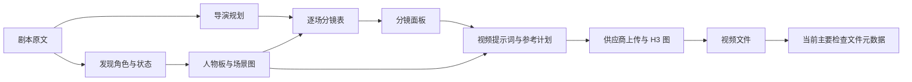

# Toonflow 全流程质量审查与优化方案

> 范围更正（2026-10-08）：用户指定按 localhost:50188/#/project 的正常项目流程审查。本文混合了正常项目与导入试制视频，部分优先级和归因不准确。**当前项目结论请以 [正常项目流程复查报告](D:/Toonflow-app-master/docs/project-flow-audit-2026-10-08.md) 为准。** 正常视频16/17/24逐槽参考hash一致；导入59/61错绑不能解释这些视频。基础四视图与衍生普通Qwen是功能分工，正常衍生链传父完整板和完整目标词；“旧front丢facts”条件行为不作为正常默认流程主因。下文保留原审查证据与历史范围。

审查日期：2026-10-08。对象：当前工作区、运行中的开发服务、`data/db2.sqlite`、已生成资产和视频。主样本是项目 **重生三天，我囤爆整个海洋**（1790665121730）的前两集，补充导入试制项目的 H3 视频 59/61/62。

## 结论

目前流程能够产出文件，但制作质量保障存在连续缺口。角色身份与画风在资产阶段没有稳定下来，导演意图在自由文本交接中容易丢失，分镜校验偏重格式与字数覆盖，面板缺少可读的视觉预览，下游还存在真实的参考图错绑和版本同步缺陷。每一层都可能显示完成，最终画面却同时受到这些问题影响。

已经确认、应优先修复的代码问题：**H3 二次排序破坏 Picture 绑定；不同入口的人物生成流程分歧；旧人物参考使目标状态事实丢失；手动编辑绕过下游失效；对白跨角色顺序与明显超时没有确定校验；分镜参考缺图会静默前移。** 这些修复具有明确的输入输出契约和可复现证据。

需要重新设计的制作环节：项目视觉锚点、角色身份目录、导演节拍与镜头映射、复杂动作的首末状态控制、分镜可读性、真实成图/成片验收。参数和模型能力需要在上述输入正确后做受控对照，当前不能给出换模型或增加采样步数必然改善的结论。

本轮只新增审查报告、抽帧证据和类型检查日志，未修改业务代码、数据库、已选资产或已完成视频，未触发新生成。工作区已有大量修改，全部保留。

## 1. 当前真实运行与生产状态

| 项目 | 当前实读结果 | 对质量的含义 |
| --- | --- | --- |
| 本地服务 | 前端 50188、后端 10588、ComfyUI 8188、Ollama 11434 正常响应 | 当前问题不能直接归为服务未运行 |
| 文本模型 | `ollama:QWEN3.8:27b`；本地 show 返回 qwen35 系列、27.3B、Q4_K_M，具有 vision/tools/thinking 能力 | 模型具有视觉能力，不代表当前 Agent 真正收到图片 |
| 主项目美术 | `realistic_3d_anime`、16:9、项目图片模型 Qwen Image 2.1、质量选项 4K | 标签存在，但不同入口实际模型与输出尺寸不一致 |
| 主项目资产 | 217 个：21 角色、110 场景、86 道具；215 个有已选图 | 数量、选图状态、描述版本对齐均不能代表美术质量 |
| 第 1 集 | 37 镜、109.5 秒；总表 revision 14；12 个真实面板 | 所有面板 `shouldGenerateImage=0`，走直接多参视频，空图为当前模式选择 |
| 第 2 集 | 27 镜、95 秒；总表 revision 5；真实面板 0 个 | 工作区 JSON 有旧面板残留，不能当作当前真实执行结果 |
| 保存的导演计划 | 两集仍为统计表、注意事项和过渡文本 | 今日较完整的导演候选尚未替换生产数据 |
| 视频记录 | 全库 62 个：55 成功、7 失败 | 成功是文件产出状态，不能计算为视觉通过率 |
| H3 实际提交图 | 抽查 6 个均为 Ref2VA、1344×768、24fps、20 步、res_multistep/simple、match，无 LoRA | 未启用 Turbo；不能把本次问题归因于 Turbo |

当前生产数据可以通过结构校验；本次反例同时证明校验仍允许明显不适合制作的内容。今天已经存在的导演/Skill 优化是进展，但其隔离文本与现存老画面不能证明整条链已经得到改善。

## 2. 当前流程中的质量损失位置

重要交接风险：A→I 缺少稳定身份/美术锚点；D→T 缺少节拍映射；T→P 依靠文本和前端回调；P→V 存在编辑后旧词继续有效；V→H 存在冻结顺序被重新排序；O→Q 缺少实际内容验收。

## 3. 最高优先级：参考图编号在真实提交时发生错绑

代码：[comfyui_local.ts](D:/Toonflow-app-master/data/vendor/comfyui_local.ts:273)。`prepareH3Config()` 在路由恢复冻结参考计划后，按角色优先重新排序，却没有改写提示词的 Picture 语义。

视频 59、61 的真实证据如下：

| 槽位 | 保存计划和提示词要求 | 实际上传 |
| --- | --- | --- |
| Picture 1 | 艾娃已经悬挂栏外的动作锚点，asset 351 | 艾娃人物图，asset 349 |
| Picture 2 | 艾娃人物图，asset 349 | 麦迪逊人物图，asset 350 |
| Picture 3 | 麦迪逊人物图，asset 350 | 动作锚点，asset 351 |
| Picture 4 | 倾斜邮轮，asset 348 | 倾斜邮轮，asset 348 |

证据来自 MP4 内嵌 ComfyUI 提交图、仍存在的实际上传文件，以及原资产与上传文件逐一相同的 SHA256。不是通过文件名猜测。参考图数量仍为 4，现有连续编号/数量检查无法发现这个错误。

这项缺陷影响自定义顺序、导入计划、将动作或场景参考放在角色前的冻结计划。自动生成时上游有时也先排角色，因此不能把所有主项目老视频都归因于此。

建议：保存后的参考计划成为唯一顺序来源；供应商严格保序。每槽携带 slotId、assetId、imageId、文件 hash，文本编译、上传和最终图都核对相同 manifest。已编号的参考缺失时明确失败。必须测试“动作锚点→人物 A→人物 B→场景”的完整调用链，而非仅分别测试参考计划和图构造。

[H3 官方参考提示词指南](https://huggingface.co/MiniMaxAI/MiniMax-H3/blob/main/docs/VIDEO_PROMPT_WRITING_GUIDE_ref_en.md)要求一致使用引用标签；[Comfy 官方节点](https://github.com/Comfy-Org/ComfyUI/blob/master/comfy_extras/nodes_minimax_h3.py)也按输入顺序形成 Picture 编号。当前六段提示词结构符合现行指南，不应依据旧笔记把六段格式本身判为缺陷。

## 4. 人物资产：身份、状态与画风三个问题需要分别处理

### 4.1 同一人物被分成两套身份

现存资产 92“维克多·凯恩”和 123“维克多”明确指同一角色，后者描述写全名维克多·凯恩，发色却分别为深色与灰金色。两者没有父身份关联，跨集会选到两套人物。

[scriptAssetExtraction.ts](D:/Toonflow-app-master/src/utils/scriptAssetExtraction.ts:79)只在循环前读取资产目录，后续批次不会看到前一批新发现的身份，去重只按类型和完整姓名。无生成模拟已复现全名/简称形成两个身份。

建议保存全剧身份目录：规范名、别名、关系、稳定 identityId；服装、年龄、湿身、伤势等作为同身份下的状态资产。合并现有重复身份前先核对保留图和关联，不删除旧生成历史。

### 4.2 三个生成入口不一致

资产库通过 [assetImageModel.ts](D:/Toonflow-app-master/src/utils/assetImageModel.ts:6)固定使用专用四视图；生产自动生成在 [batchGenerateAssetsImage.ts](D:/Toonflow-app-master/src/routes/production/assets/batchGenerateAssetsImage.ts:145)直接用项目普通 Qwen 和 16:9。数据库衍生人物 202–204 的实际模型记录支持这一差异。普通图生图输出还会直接标成 four_view、ready，没有验证四栏真的成立。

建议所有入口共享“有效模型→身份参考→目标态正面→其他视角→拼板→候选保存”的流程。界面显示实际执行的模型及能力，避免选项与实际路由不符。

### 4.3 旧图可能使换装/新状态提示词完全失效

[comfyui_qwen21_fourview.ts](D:/Toonflow-app-master/data/vendor/comfyui_qwen21_fourview.ts:148)有参考图时直接复制为正面；后三视角编码不包含目标 facts，要求保持参考人的衣装、状态和画风。提供父身份或旧正面来换装时，新状态在所有编码中出现 0 次，已通过唯一目标 token 模拟确认。

供应商正确接收“已完成目标态正面”时，直接扩视角是合理行为。问题是调用层把父身份、旧状态与已确认目标态正面都叫参考图，没有明确合同。

建议拆开 identityReference 与 currentStateFrontAnchor。旧图先执行带目标事实的正面编辑，已正确的新正面才允许跳过。

### 4.4 缺少能真正参与首次设计的视觉风格锚点

实看艾娃、麦迪逊、维拉及公寓：人物四栏基本成立，但艾娃偏自然比例的写实游戏 CG，另外两人更柔化、动画化，公寓偏建筑写真。它们没有稳定统一的国漫美术抽象程度。

当前 API 的 styleBase64 必须与人物图一起传，有人物图又不生成新正面；UI 没有提交 styleBase64。风格参考无法决定首次正面，也没有共享路径影响所有角色和场景。

建议先确认少量美术基准：男女主角、室内、灾变外景。身份图与风格图分别承担身份和媒介/比例/材质作用，风格图参与第一次正面与场景设计。具体审美方向先通过候选图比较确定，不能仅增加“高级、电影感、4K”等词。

### 4.5 4K 标签与有效像素不符

[comfyui_local.ts](D:/Toonflow-app-master/data/vendor/comfyui_local.ts:152)普通 Qwen 的 2K 和 4K 都是最长边 2048；主项目公寓确为 2048×1152。当前专用四视图 4K 每栏 1024×1536，整板宽度不代表每个人物达到 4K。历史人物板有不同尺寸，不能用当前公式倒推历史输出。

建议显示原生图尺寸、每视角尺寸及视频侧缩放后的有效尺寸。美感与分辨率分别验收。

## 5. 导演规划：需要把叙事判断变成可执行的制作计划

当前生产计划还是统计预算、注意事项和过渡；今日隔离候选已有 12 个节拍，但尚未进入真实前两集。新代码改善上下文和温度，没有自动改善旧数据。

建议导演输出保存最小结构：每场目标、观众新增信息、情绪变化、节拍来源、人物进入/退出状态、关键表演、空间关系、预期时长、需要验证的复杂动作。Markdown 从结构渲染，方便阅读。

每镜引用明确的 beatId 与来源事件。下游应能够回答：这一镜推进哪个节拍？开头人物在哪里、抓着什么？结尾发生了什么不可逆变化？下一镜从哪个状态继续？缺少这些关系，镜头表容易只把原文重新分行。

[screenplay.ts](D:/Toonflow-app-master/src/agents/productionAgent/screenplay.ts:100)未命中“逐场导演设计”标题就跳过节拍校验；旧稿兼容可以保留，但新稿应具备明确 schema/qualityVersion。当前监制还主动排除缺失基础资产，导致第 2 集采购片段只有艾娃与界面引用，没有稳定的商店环境参考。

制作判断还必须考虑模型执行难度。掰手指、重力下坠、多人接触、场景转换、字幕与 UI，不能只依据总时长足够就一起打包。

## 6. 分镜表：确定校验不足，节奏也需要重新审查

| 发现 | 证据 | 建议 |
| --- | --- | --- |
| 对白全局顺序可倒转 | 按 speaker 聚合，问答反序仍 valid/coverageVerified | 保存来源对白事件序列和顺序，允许拆句但不允许倒转因果 |
| 明显口播超时仍通过 | 92 字对白放 1 秒，预算一致就通过 | 估算/实测口播时间与串行动作，明显不可完成时阻止进入视频 |
| 人工总表保存绕过修订链 | saveFlowData 只删 progress，未同步面板/失效旧词 | 人工与 AI 共用一个修订事务和版本校验 |
| 片段内动作/信息过载 | 6 秒片段同时有掰手、坠落、落水和鲨攻击；15 秒片段有惊醒、电视、多个闪回和界面 | 按可执行状态变化划分制作单元，先验证高难度单元 |
| 同一动作重复 | 第 1 集末段两次放下手机，中间没有再次拿起 | 校验道具与动作状态链，删除无新信息的重复 |
| 物理机制不明确 | 第 2 集手指连线路却出现墙面笔迹，没有工具/机制 | 指明可见动作、工具、接触点和结果 |
| 节奏推进偏弱 | 23 字报价由 7＋9 秒近景承载，新信息变化不足 | 以信息/压力/表演变化安排时长，再验证口播窗口 |

口播估算不能机械把所有动作相加，反应、呼吸与台词可并行；有真实音轨时用实测替换估算。Provider 的 15 秒上限只用于最后编译片段，不应决定整集戏剧节奏。

代码与反例详情见 [导演与分镜分项报告](D:/Toonflow-app-master/docs/quality-audit-2026-10-08-directing.md)。

## 7. 分镜面板与工作台：当前没有形成有效的制作预览

第一集 12 个面板明确跳过分镜图片，不能称为图片生成失败。但 UI 一律显示“未生成”，没有解释当前片段采用直接多参模式，也没有展示足够清楚的起止姿态与构图。

实读浏览器 `/#/production`：画布 transform 为 `scale(0.107006)`，约 10.7%；整张分镜总表显示高度约 727px、宽度约 115px，工作台节点约 30×24px。完整剧本和总表被放进无限高度节点，再 fitView，导致文字极小。代码为 [production/index.vue](D:/Toonflow-app-master/Toonflow-web-master/src/views/production/index.vue:28)、总表节点与 layoutGraph/fitView 路径。

建议工作界面改为可阅读的阶段主区：剧本、人物/场景、导演、镜头、成片。流程图保留为概览；主区使用固定摘要卡＋展开详情。分镜采用横向胶片条或列表，每块展示时长、目的、起始/结束状态、人物/场景参考缩略图、实际生成方式、候选与采用状态。刷新数据保持用户当前阶段与缩放位置。

代码一致性问题还包括：

- [editStoryboardInfo.ts](D:/Toonflow-app-master/src/routes/production/storyboard/editStoryboardInfo.ts:18)手动面板编辑仅更新 prompt/videoDesc，旧视频词、资产关系和时长可能继续使用。
- 总表 revision 提交通知只刷新总表，前端面板副本不刷新；Agent 又读取该副本。执行数据应以服务端真实表为权威。
- 首帧逐镜模式的文本无法匹配现有整片段同步规则。应保存 shotId/segmentId 与 sourceRevision，不能把文本相同作为唯一映射。
- [batchGenerateImage.ts](D:/Toonflow-app-master/src/routes/production/storyboard/batchGenerateImage.ts:110)缺图/读取失败后静默 filter，使 @图编号前移。应与视频共享保序参考 manifest。

模式建议按片段需求选择：简单表演可以直接多参；复杂接触、坠落、精确站位先确认构图/起止状态；信息界面与可读文字采用独立画面或后期合成。保留完整人物板占一个 Picture 的现行规则，不自动恢复独立方向裁切。

## 8. 视频实际抽查：动作与接续状态已经出现失败

抽查主项目 16/17/24 与试制 59/61/62，按真实提交 prompt 对照帧序列。

- **59**：要求已在栏外、禁止抬膝爬栏，实际约 1–3 秒出现抬膝上移动作；同时有 Picture 错绑。
- **61**：要求结尾只剩最后一指，7.88 秒尾帧仍整掌握栏。
- **62**：开头重新双手强握，未接上上一片目标状态；5.047 秒尾部确实开始放手下坠，不能误判为整片没有下坠。
- **16**：要求近景开场，实际先给完整邮轮远景，指定镜头组织执行不稳定。
- **17/24**：列出了多事件负载、手机 UI 可读性等待核验项；稀疏缩略图不足以宣布所有接触、切镜或字幕失败。

主项目实际使用 en-US 语言快照，快照与 MP4 提交文本匹配，不能拿今天中文基础词解释历史英文视频。本轮未听辨音轨，不给口型或对白准确率通过结论。

当前图只用语义 ref_images，没有时间轴 guide，也没有载入上一片尾帧。把一个 Picture 写成 first-frame anchor 不会自动形成帧索引约束。本机已安装 MiniMaxH3AddGuide；[官方节点源码](https://github.com/Comfy-Org/ComfyUI/blob/master/comfy_extras/nodes_minimax_h3.py)支持带 frame_idx 的图像/片段引导，值得在修复排序后独立实验。已验收的起止帧才能用于接续，不能自动传播错误尾帧。

## 9. 质量审核：现有“通过”主要没有检查真实画面

资产 `reviewAssetImage` 没有生产调用，现有测试把直接采用设为期望策略。H3 的 `h3SemanticReview` 同样只有定义，没有运行调用者。监制上下文还删除图片 src，当前主要审核文字。

[videoQuality.ts](D:/Toonflow-app-master/src/utils/videoQuality.ts:8)只是 ffprobe 元数据，失败返回空对象；视频保存后即可标“生成成功”。因此 59/61 的错误动作仍是成功任务。

建议状态清楚区分：文件产出、内容检查、候选、采用。确定检查负责解码、时长、明显黑/重复帧、参考与版本；视觉/音频审核给出带时间码的问题证据；高价值身份图、复杂动作和片段接续由用户明确采用。候选历史与已有选用结果保留，可快速回退。

不能将另一个自由文本打分 Agent 当作完整质量保证。审核必须能指向具体图、具体时间码、来源要求与当前版本。

## 10. 建议实施顺序与完成标准

| 顺序 | 工作 | 完成标准 |
| --- | --- | --- |
| 1：输入与修订正确 | Picture/@图 manifest 保序；缺图明确失败；人工/AI 共用修订；刷新面板；旧词失效；对白顺序与明显超时 | 完整调用链反例被拒绝或正确修复；页上改动与最终提交图一致；保留旧视频 |
| 2：人物与美术稳定 | 身份/别名归一；统一生成入口；目标态正面编辑；首次风格图；真实尺寸/seed/配置快照 | 同一角色跨状态保持身份且衣装真的改变；人物与场景方向一致；所有入口合同相同 |
| 3：导演与面板可执行 | 版本化节拍/镜头结构；beat→shot 映射；状态链；可读阶段界面；按难度选择制作方式 | 能从每镜追溯导演意图；片段接续可预览；重复动作、缺参考、未说明机制可发现 |
| 4：视频效果验证 | 代表片验收集；固定 seed；参数与 guide 单变量实验；真实图/帧/音轨检查 | 同一套难例可重复比较；报告内容通过率、返工量、耗时与成本，不只报告任务成功率 |

先做第 1 阶段可以阻止继续喂错输入，第 2、3 阶段决定可用的视觉与镜头基础，第 4 阶段证明实际改善。无需整剧重生成，也不应自动替换已完成成果。

## 11. 最小受控验收集

建议六类样本：主角近景与全身；同身份换装/湿身；双人接触与手部动作；放手下坠首末状态；室内手机表演；灾变外景与信息界面。每类固定来源、身份、参考 hash、prompt、语言、seed 和工作流版本。

先以 59/61 的原输入，仅改变参考顺序做对照。之后分别比较 match/max、20/25 步、simple/beta/normal、无/有 guide，每轮只改一项。整张人物板仍作为一个 Picture。`max` 有官方身份细节依据，但更慢；采样替代同样只是实验候选。[Comfy 官方节点文档](https://github.com/Comfy-Org/docs/blob/main/built-in-nodes/MiniMaxH3ReferenceToVideo.mdx)与[官方教程](https://github.com/Comfy-Org/docs/blob/main/tutorials/video/minimax/minimax-h3-native.mdx)可作为参数语义依据。

验收记录应包括：身份/服装/画风、首末状态、空间关系、动作完成、对白及口型、信息可读性、有效时长、生成耗时、返工次数。无法由自动程序可靠判定的审美项保留人工评分和对照图。

本轮没有运行以上新生成实验，因此这些方案尚未得到真实改善结果。

## 12. 本轮验证与交付

- 资产链 49 项、导演/分镜 21 项、H3/参考/上下文 27 项：共 **97 项针对测试通过**。未重复运行全库测试。
- 新增无生成反例：别名拆身份；目标态 facts 消失；问答反序仍通过；92 字/1 秒仍通过；逐镜同步冲突。供应商真实重排由历史 MP4 和文件 hash 证明。
- 当前 `tsc --noEmit` 报 **83 个类型错误**，日志已保存。说明工程检查没有达到通过状态，但不能据此把所有画面问题归因于类型错误。
- 源码、tests、Skills 与前端源码的定向 whitespace 检查通过；全仓库生成产物不作为本次检查范围。
- 审查开始/结束的两集生产工作区内容 SHA256 相同：id1 `f9668719b137a62fdd619b8c1470d4f2d220c7da14e6fcaf4f9f035fc8b1df9c`；id38 `f2b457f9d6f920d3c1602f951dbee766456ae758b35564ab8aeb6a589b453f63`。

详细分项与证据：

- [资产链报告](D:/Toonflow-app-master/docs/quality-audit-2026-10-08-assets.md)
- [导演、分镜表与面板报告](D:/Toonflow-app-master/docs/quality-audit-2026-10-08-directing.md)
- [视频链报告](D:/Toonflow-app-master/docs/quality-audit-2026-10-08-video.md)
- [H3 引用顺序与 SHA256 证据](D:/Toonflow-app-master/docs/quality-audit-2026-10-08-media/h3-reference-order-evidence.json)
- [视频 59 帧序列](D:/Toonflow-app-master/docs/quality-audit-2026-10-08-media/video-59-frames.jpg)
- [视频 61 尾帧](D:/Toonflow-app-master/docs/quality-audit-2026-10-08-media/video-61-end.jpg)
- [当前类型检查日志](D:/Toonflow-app-master/docs/quality-audit-2026-10-08-typecheck.log)

分项报告给出代码位置、触发边界、复现方式和具体优化建议。审查结论支持开始针对性修复；它不代表当前人物审美与成片质量已经修好。
